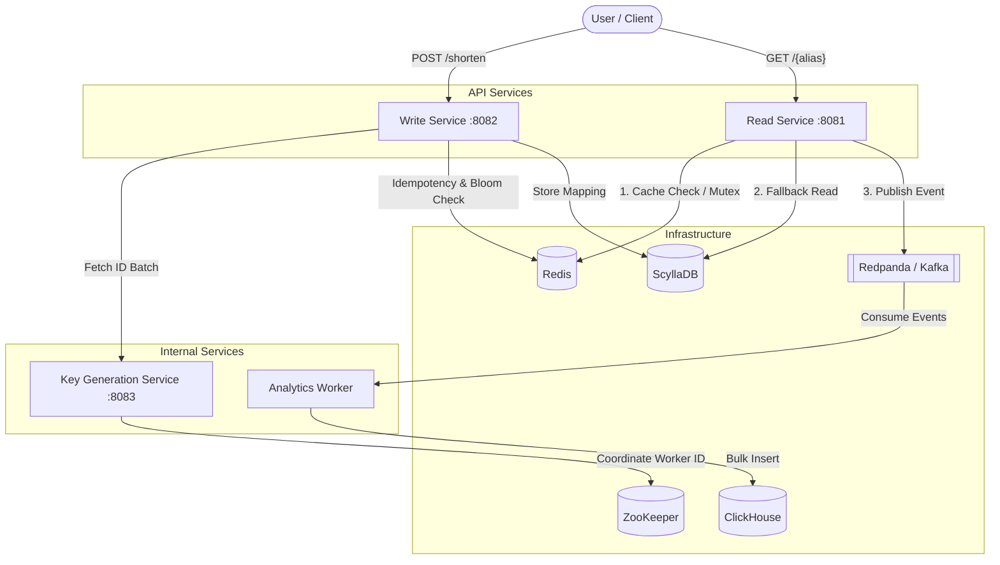

# 🚀 High-Performance URL Shortener Microservices


A massively scalable, highly concurrent, and distributed URL Shortener built with Go. This project implements enterprise-grade patterns including **Bloom Filters**, **Idempotency Caching**, **Cache Stampede Prevention (Mutex Locks)**, and **Asynchronous Event-Driven Analytics**.

---

## 🏗️ System Architecture

This project is broken down into four completely decoupled microservices, communicating via high-performance datastores and event streams.



---

## 🛠️ Microservices & Workflow

### 1. 🔑 Key Generation Service (KGS)
Responsible for generating unique, collision-free short aliases completely statelessly.
- Utilizes **ZooKeeper** to assign unique 10-bit Worker IDs.
- Generates 64-bit **Snowflake IDs** guaranteeing chronological sorting and uniqueness.
- Encodes the IDs using **Base62** to create compact URL aliases (e.g., `2tsia7WKOqs`).

### 2. ✍️ Write Service (URL Shortener)
Handles the creation of new short URLs.
- **Idempotency Check:** Checks Redis to see if a user has recently shortened the exact same URL to prevent duplicates.
- **Bloom Filter Pre-check:** If a user requests a custom alias (e.g., `/my-brand`), it instantly checks a Redis Bloom Filter to ensure it hasn't been taken, avoiding a heavy database read.
- **Persistence:** Saves the final `short_alias -> long_url` mapping into a globally distributed **ScyllaDB** cluster.

### 3. 📖 Read Service (Redirection)
Built for sub-millisecond latency. Handles redirecting users to their original destinations.
- **Multi-tiered Caching:** Attempts to fetch the long URL from **Redis**. If it misses, it fetches from ScyllaDB and updates the cache.
- **Cache Stampede Prevention:** Implements Redis Mutex Locks (`SETNX`). If a viral link expires from cache, only *one* thread is allowed to query the database to prevent overwhelming ScyllaDB.
- **Async Analytics:** Instead of slowing down the HTTP response to record the click, it instantly publishes a `url_redirected` event to **Redpanda (Kafka)** in the background.

### 4. 📊 Analytics Worker
An offline, high-throughput consumer that builds our analytics dashboard data.
- Listens to the `url_created` and `url_redirected` topics on Redpanda via a Kafka Consumer Group.
- Flushes streams of events in bulk directly into the **ClickHouse** Data Warehouse (`MergeTree` engine) for blazing-fast analytical queries.

---

## 🚀 Getting Started

### Prerequisites
- [Docker](https://www.docker.com/) & Docker Compose
- [Go 1.25+](https://golang.org/)

### 1. Start the Infrastructure
Bring up the entire data layer (ScyllaDB, Redis, ZooKeeper, Redpanda, ClickHouse) using Docker Compose.
```bash
docker compose up -d
```
> *Wait about 15-30 seconds for all databases to fully initialize.*

### 2. Run the Microservices
Open **four separate terminal windows** and start the services locally:

**Terminal 1:** Start the Key Generation Service
```bash
go run ./cmd/kgs/main.go
```

**Terminal 2:** Start the Write Service
```bash
go run ./cmd/write-service/main.go
```

**Terminal 3:** Start the Read Service
```bash
go run ./cmd/read-service/main.go
```

**Terminal 4:** Start the Analytics Worker
```bash
go run ./cmd/analytics-worker/main.go
```

---

## 🧪 Testing the Pipeline

### 1. Create a Short URL (Write Service)
You can optionally provide a `custom_alias`, or omit it to have the KGS automatically generate one for you!
```bash
curl -X POST http://localhost:8082/shorten \
  -H "Content-Type: application/json" \
  -d '{"long_url": "https://github.com/topics/golang", "custom_alias": "golang-repo"}'
```
**Expected Response:**
```json
{
  "short_url": "http://localhost:8081/golang-repo"
}
```

### 2. Trigger a Redirect (Read Service)
Navigate to the generated URL in your browser, or use `curl`:
```bash
curl -v http://localhost:8081/golang-repo
```
*You will receive a `302 Found` response redirecting you to the long URL.*

### 3. Verify Analytics (ClickHouse)
Every time you create a URL or click a redirect, events flow through Kafka into ClickHouse. Query your data warehouse:
```bash
docker exec -it urlshortener-clickhouse clickhouse-client --password password --query "SELECT short_id, event_type, timestamp FROM analytics_events"
```
**Expected Output:**
```text
golang-repo    created       2026-07-15 12:00:00
golang-repo    redirected    2026-07-15 12:01:05
golang-repo    redirected    2026-07-15 12:01:07
```

---

## 🛡️ Running Automated Tests

The project is heavily tested with isolated unit tests using interface mocking. To run the full AI Verification test suite across all packages:

```bash
go test ./... -v
go vet ./...
```

---

## 📁 Repository Structure

```text
/cmd
  /analytics-worker   # Analytics Kafka Consumer entrypoint
  /kgs                # Key Generation Service entrypoint
  /read-service       # Redirection API entrypoint
  /write-service      # Shortening API entrypoint
/deploy
  init.cql            # ScyllaDB schema initialization
  init.sql            # ClickHouse schema initialization
/internal
  /analytics          # Redpanda consumer & ClickHouse inserter logic
  /kgs                # Snowflake ID & Base62 encoding logic
  /read               # Redirect logic, Redis caching, Stampede mutex
  /write              # Shortening logic, Idempotency, Bloom Filter
/pkg
  /cache              # Redis wrappers
  /config             # Environment variable parsing
  /db                 # ScyllaDB & ClickHouse connection wrappers
  /kafka              # Redpanda publisher logic
  /kgsclient          # Internal HTTP client to interface with KGS
docker-compose.yml    # Infrastructure orchestration
```
